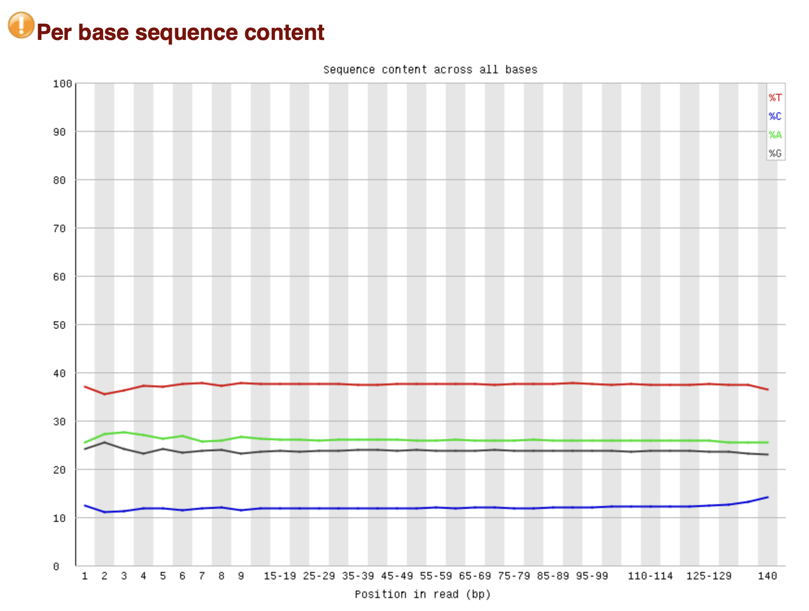
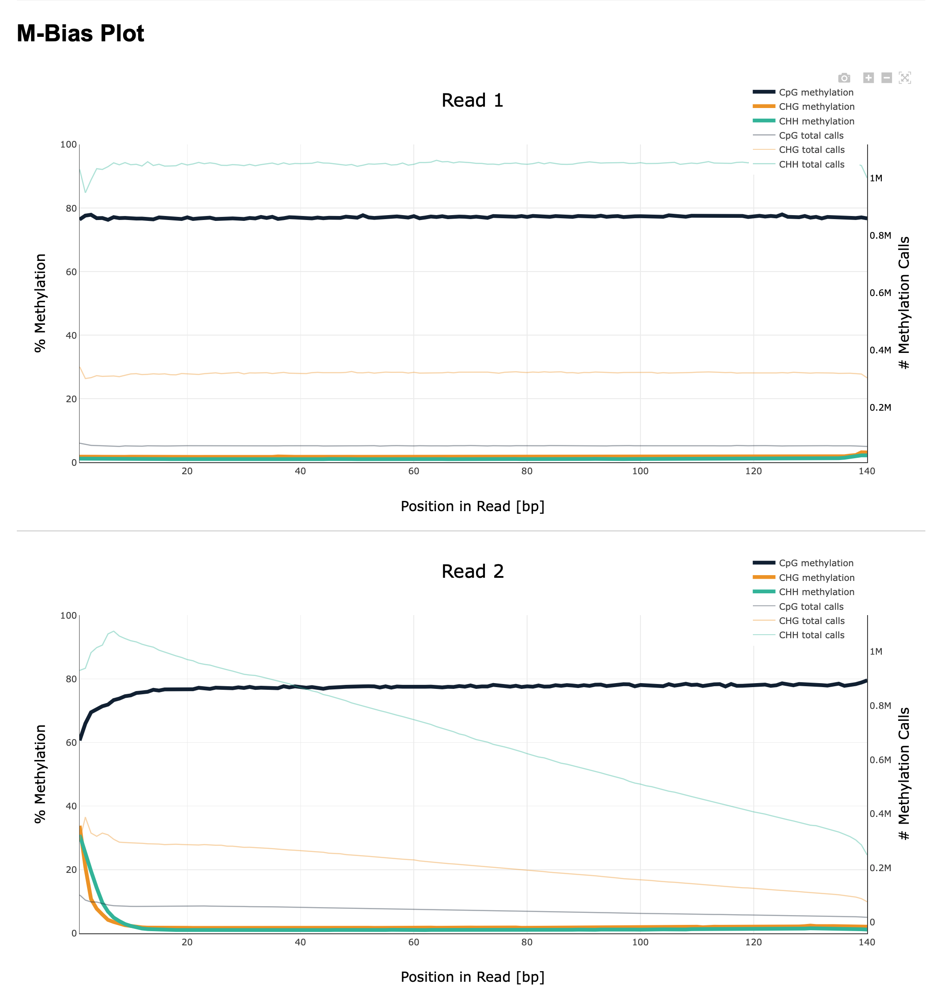
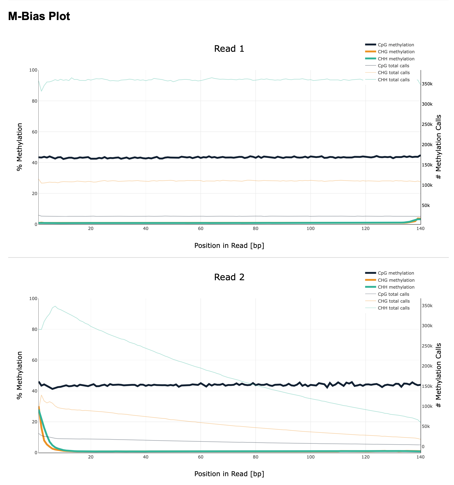
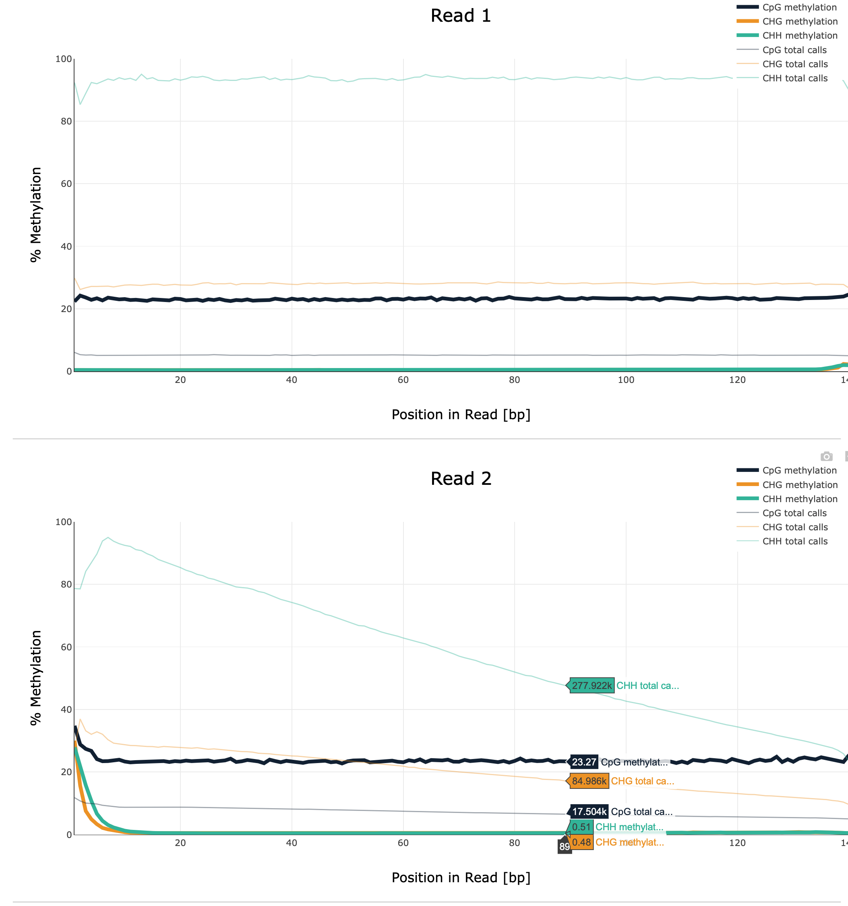
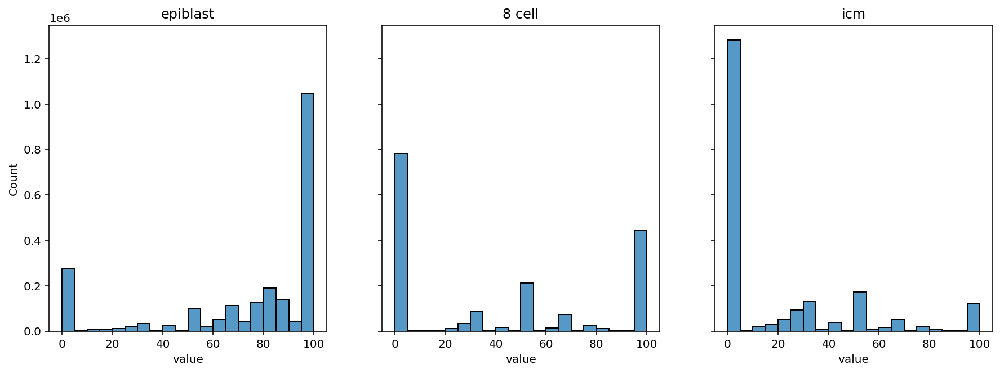

[colab](https://colab.research.google.com/drive/1K0CYLioVsE7zOCl8F9-3qx15d4ANumKp?usp=sharing)

# 1

можно заметить, что C и T отличаются примерно на одинаковое количество от A и G, но в разные стороны. это связано с тем, что при обработке бисульфитом, неметилированный цитозин заменяется на урацил, который считывается как тимин.

# 2

#### Statistics
Stage    | Nr         | Report        | Reads 11347700-11367700 | Reads at 40185800-40195800 | % Dups
---------|------------|---------------|-------------------------|----------------------------|-------
Epiblast | SRR3824222 | [тык][rep222] | 2328                    | 1062                       | 2.92%
8 cell   | SRR5836473 | [тык][rep473] | 1090                    | 464                        | 18.31%
ICM      | SRR5836475 | [тык][rep475] | 1456                    | 630                        | 9.08%

#### M-bias
Epiblast | 8 cell | ICM
---------|--------|----
 |  | 

#### распределение

[rep222]: ./reports/SRR3824222_1_bismark_bt2_PE_report.html
[rep473]: ./reports/SRR5836473_1_bismark_bt2_PE_report.html
[rep475]: ./reports/SRR5836475_1_bismark_bt2_PE_report.html